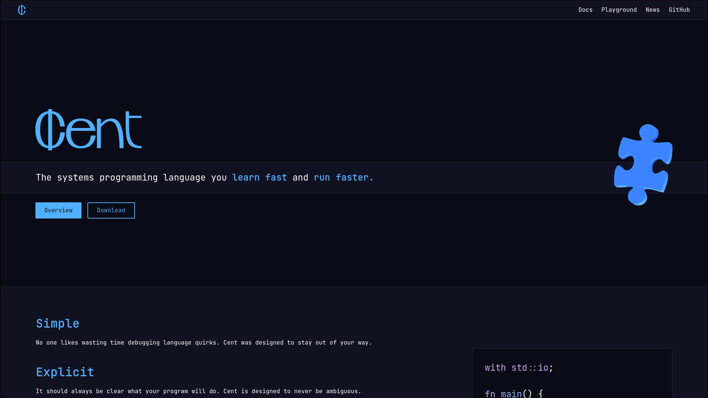

# centlang.org

Website for Cent programming language, built completely from scratch.



## Running locally

Requirements:

- Python 3
- Docker (for language playground)
- Neovim (for syntax highlighting)
- cent.vim (for Cent syntax highlighting)

Clone the repository:

```sh
$ git clone https://github.com/centlang/centlang.org
$ cd centlang.org
```

Build the website:

```sh
$ cd frontend
$ pip install -r requirements.txt
$ python build.py
$ cd ..
```

Prepare the backend:

```sh
$ cd backend
$ docker build -t centc .
$ pip install -r requirements.txt
$ cd ..
```

Run the server:

```
$ uvicorn main:app --app-dir backend
```
